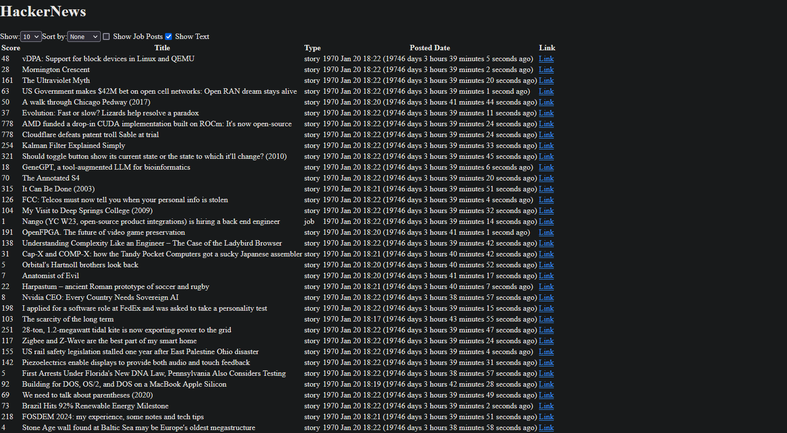

# Elm Hacker News App



This project is a basic Hacker News client implemented in Elm. It fetches the top stories and displays them in a table, allowing users to filter and sort posts by various criteria.

## Installation and Setup

### Cloning the Repository

Clone this repository using the following command:

```sh
git clone https://github.com/AndreiE91/Elm-Hacker-News-App.git
cd Elm-Hacker-News-App
```


### Installing Dependencies

After cloning the repository, navigate to its directory and run:

```sh
npm install
```


This will install the dependencies needed for automated tests.

### Running the Application

To start the application, run:

```sh
elm reactor
```
Then open the `src/Main.elm` file in your browser.


Then open the `src/Main.elm` file in your browser.

## Project Structure

The project structure is as follows:

- `src`: Contains the workspace.
- `tests`: Evaluation tests.
- `scripts`: Utility scripts.
- `elm.json`: Elm project configuration.
- `package.json`: npm project configuration.

## Running Tests

To run all tests and see detailed explanations for all failures, use:

```sh
npm test
```

